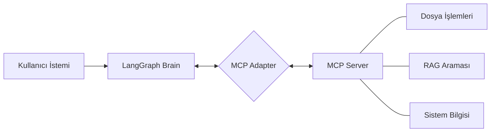
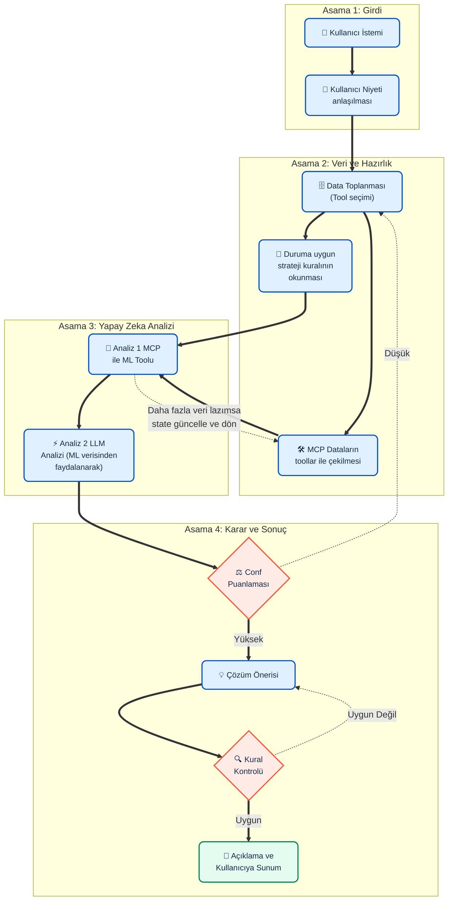

# Başlangıç

Pipenv sanal ortama yükle:

```bash
pip install pipenv
python -m pipenv install mcp google-genai pydantic python-dotenv
python -m pipenv install langgraph langchain-google-genai
python -m pipenv install langchain-ollama

```

## GEt Ollama 

```bash
curl -fsSL https://ollama.com/install.sh | sh
```

```bash
ollama run llama3.1
ollama run qwen2.5:3b
```


# Kullanım


Ollama başlat (eğer lokalse)

Sanal ortamdan başlat:

```bash
python -m pipenv run python3 client.py
```

# SimpleMCPClient

## client.py
Gemini ile sohbet eder. Toolları MCP'den dinamik olarak çeker ve Gemini'ye iletir:

```python
response = gemini_client.models.generate_content(
    model='gemini-2.5-flash',
    contents=user_input,
    config=types.GenerateContentConfig(
        tools=[tool_config],
    )
)
```

## server.py
MCP sunucusu burada çalışır. Yeni toollar buraya eklenir.


# LangGraphMCP+RagClient
### LangGraph + MCP + RAG Nasıl Çalışır?

Bu sistem, yapay zekanın yerel araçlarla nasıl etkileşime girdiğini üç katmanda yönetir:

1.  **Beyin (LangGraph):** İş akışını ve "karar verme" sürecini yönetir. Kullanıcının ne istediğini anlar ve hangi aracın ne zaman kullanılacağına karar verir.
2.  **Kablo (MCP Adapter):** MCP sunucusundan gelen ham araçları, LangGraph'ın (Gemini/Claude) anlayabileceği "LangChain Tool" formatına otomatik olarak dönüştürür.
3.  **Eller (MCP Server):** Gerçek işi yapan kısımdır. Dosya yazma, okuma veya RAG (Bilgi tabanı) araması gibi işlemleri gerçekleştirir.

#### Kritik Adım: Tool Seçimi
Niyet anlaşıldıktan sonra, LLM hangi araçların (Performance, Rules, Pattern vb.) kullanılacağına karar verir. Bu adım, "Eller"e hangi işi yapacağını söyleyen "Sinir Sistemi" gibidir.



# Final Target

## workflow



## State


```mermaid
flowchart TD
    %% --- Stil ve Tema Tanımlamaları ---
    classDef mainStep fill:#1A365D,stroke:#2B6CB0,stroke-width:3px,color:#FFFFFF,rx:8px,ry:8px,font-weight:bold;
    classDef subCategory fill:#EBF8FF,stroke:#3182CE,stroke-width:2px,color:#2C5282,rx:5px,ry:5px;
    classDef metricItem fill:#F0FFF4,stroke:#38A169,stroke-width:1px,color:#22543D,rx:20px,ry:20px;
    classDef default font-family:sans-serif;

    %% --- 1. GİRDİ ---
    subgraph Adım 1: Girdi
        A["📥 GİRDİ (Input)"]:::mainStep
        A --> A1["👤 Kullanıcı Sorusu"]:::subCategory
        A --> A2["⏳ Zaman Aralığı"]:::subCategory
        A --> A3["🎭 Kullanıcı Rolü"]:::subCategory
    end

    %% --- 2. NİYET ANALİZİ ---
    subgraph Adım 2: Niyet Analizi
        B["🧠 NİYET ANALİZİ"]:::mainStep
        B --> B1["🎯 Intent (Niyet)"]:::subCategory
        B --> B2["📝 Açıklama"]:::subCategory
    end

    %% --- 3. VERİ KATMANI ---
    subgraph Adım 3: Veri Katmanı
        C["🗄️ VERİ KATMANI"]:::mainStep
        
        C --> C1["📌 Gerekli Metrikler"]:::subCategory
        C --> C5["📜 Strateji Kuralları"]:::subCategory
        
        C --> C2["📈 Performans Metrikleri"]:::subCategory
        C2 -.-> C21(["ROAS"]):::metricItem
        C2 -.-> C22(["Dönüşüm Oranı"]):::metricItem
        C2 -.-> C23(["Satış Adedi"]):::metricItem
        C2 -.-> C24(["Ciro"]):::metricItem
        C2 -.-> C25(["Reklam Harcaması"]):::metricItem

        C --> C3["💰 Ürün Maliyet Bilgisi"]:::subCategory
        C3 -.-> C31(["Birim Maliyet"]):::metricItem
        C3 -.-> C32(["Satış Fiyatı"]):::metricItem
        C3 -.-> C33(["Kar Marjı"]):::metricItem

        C --> C4["📉 Trend Verileri"]:::subCategory
        C4 -.-> C41(["Satış Trendi"]):::metricItem
        C4 -.-> C42(["Reklam Trendi"]):::metricItem
        C4 -.-> C43(["Dönüşüm Trendi"]):::metricItem
    end

    %% --- 4. ANALİZ ---
    subgraph Adım 4: Analiz Sonuçları
        D["📊 ANALİZ"]:::mainStep
        D --> D1["📋 Durum Özeti"]:::subCategory
        D --> D2["🔍 Tespit Edilen Desenler"]:::subCategory
        D --> D3["⚠️ Risk Faktörleri"]:::subCategory
    end

    %% --- 5. ÖNERİLER ---
    subgraph Adım 5: Strateji ve Öneriler
        E["💡 ÖNERİLER"]:::mainStep
        E --> E1["⭐ Ana Öneri"]:::subCategory
        E --> E2["🔄 Alternatif Öneriler"]:::subCategory
        E --> E3["🚀 Beklenen Etki"]:::subCategory
    end

    %% --- 6. AÇIKLAMA ---
    subgraph Adım 6: Karar Açıklaması
        F["💬 AÇIKLAMA"]:::mainStep
        F --> F1["⚖️ Karar Gerekçesi"]:::subCategory
        F --> F2["📂 Kullanılan Veriler"]:::subCategory
        F --> F3["⚙️ Uygulanan Strateji Kuralları"]:::subCategory
    end

    %% --- ANA AKIŞ BAĞLANTILARI ---
    A ==> B
    B ==> C
    C ==> D
    D ==> E
    E ==> F


---

---

# 🚀 Yeni Bir Özellik Nasıl Eklenir? (Basit Rehber)

Kod bilmenize gerek yok! Sistemi genişletmek için sadece **iki adım** yeterli:

### 1. Adım: Yeni Yeteneği Tanımla (Python)
`langgraph_system/mcp_server.py` dosyasına git ve yeni fonksiyonunu ekle:

```python
@mcp.tool()
def stok_durumu() -> str:
    """Depodaki ürünlerin sayısını söyler."""
    return "iPhone 15: 10 adet, Samsung S24: 5 adet"
```

### 2. Adım: Yeteneği Yapay Zekaya Bağla (YAML)
`langgraph_system/intents.yaml` dosyasına git ve yeni fonksiyonunu bir **Niyete (Intent)** bağla:

```yaml
# Örnek: 'info_only' niyetine yeni tool'u bağladık
info_only:
  description: "Ürün ve stok bilgilerini verir"
  tools:
    - list_products
    - stok_durumu  # ← Buraya eklediğin an yapay zeka bunu kullanmaya başlar!
```

---

## 🎨 Sisteme Yeni Bir "Niyet" (Grup) Eklemek
Diyelim ki sisteme **"Raporlama"** adında tamamen yeni bir kategori eklemek istiyorsunuz:

`intents.yaml` içine şu bloğu yapıştırın:

```yaml
reporting:
  description: "Satış raporları oluşturur ve özetler"
  examples:
    - "bugünkü satış raporunu çıkar"
    - "bu ay ne kadar sattık"
  tools:
    - get_sales_data  # (Bu isimde bir tool'u mcp_server.py'ye eklemiş olmalısın)
```

**Sonuç:** Yapay zeka artık "bugünkü satış raporunu çıkar" dendiğinde otomatik olarak `reporting` kategorisine gidecek ve sadece oradaki araçları kullanacaktır!

---

## 💡 Özet: Hangi Dosya Ne İşe Yarar?

| Dosya | Görevi | Ne Zaman Düzenlenir? |
|---|---|---|
| `mcp_server.py` | **Eller** (İşi yapar) | Yeni bir fonksiyon/araç eklemek istiyorsan. |
| `intents.yaml` | **Harita** (Yol gösterir) | Araçları gruplamak veya yeni niyetler eklemek istiyorsan. |
| `.env` | **Ayar** (LLM seçer) | Gemini veya Ollama arasında geçiş yapmak istiyorsan. |
| `main.py` | **Motor** (Sistemi kurar) | *Genellikle dokunmanıza gerek yok.* |
| `graph.py` | **Zihin** (Karar verir) | *Genellikle dokunmanıza gerek yok.* |
