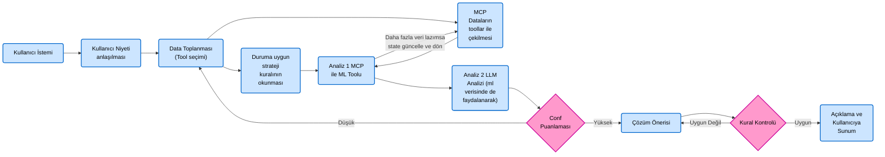

# Başlangıç

Pipenv sanal ortama yükle:

```bash
python -m pipenv install mcp google-genai pydantic python-dotenv
python -m pipenv install langgraph langchain-google-genai

```

Sanal ortamdan başlat:

```bash
python -m pipenv run python3 client.py
```

# SimpleMCPClient

## client.py
Gemini ile sohbet eder. Toolları MCP'den dinamik olarak çeker ve Gemini'ye iletir:

```python
response = gemini_client.models.generate_content(
    model='gemini-2.5-flash',
    contents=user_input,
    config=types.GenerateContentConfig(
        tools=[tool_config],
    )
)
```

## server.py
MCP sunucusu burada çalışır. Yeni toollar buraya eklenir.


# LangGraphMCP+RagClient


## workflow
```graph LR
    %% Düğüm Tanımlamaları
    A["Kullanıcı İstemi"]
    B["Kullanıcı Niyeti<br>anlaşılması"]
    C["Data Toplanması<br>(Tool seçimi)"]
    D["Duruma uygun<br>strateji<br>kuralının<br>okunması"]
    E["MCP<br>Dataların<br>toollar ile<br>çekilmesi"]
    F["Analiz 1 MCP<br>ile ML Toolu"]
    G["Analiz 2 LLM<br>Analizi (ml<br>verisinde de<br>faydalanarak)"]
    H{"Conf<br>Puanlaması"}
    I["Çözüm Önerisi"]
    J{"Kural Kontrolü"}
    K["Açıklama ve<br>Kullanıcıya<br>Sunum"]

    %% Akış Bağlantıları
    A --> B --> C
    
    C --> D
    C --> E
    
    D --> F
    E --> F
    
    F -->|Daha fazla veri lazımsa<br>state güncelle ve dön| E
    F --> G
    
    G --> H
    
    H -->|Düşük| C
    H -->|Yüksek| I
    
    I --> J
    
    J -->|Uygun Değil| I
    J -->|Uygun| K

    %% Renklendirme ve Stiller (Görseldeki renklere uygun)
    classDef blueBox fill:#cce5ff,stroke:#0066cc,stroke-width:2px,color:#000,rx:5px,ry:5px;
    classDef pinkDiamond fill:#ff99cc,stroke:#cc0099,stroke-width:2px,color:#000;

    class A,B,C,D,E,F,G,I,K blueBox;
    class H,J pinkDiamond;
```


## state





# Final Target

